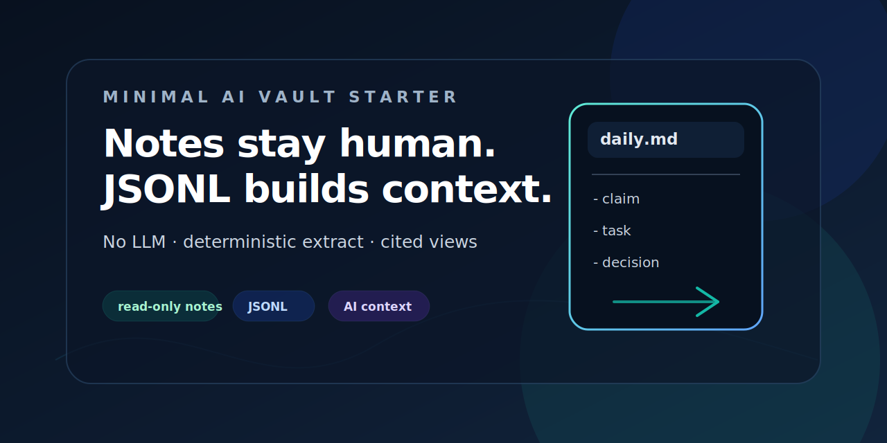

# Minimal AI Vault Starter

A public-safe starter kit for a minimal AI-enabled Obsidian/JSONL vault.

Write only daily notes and inbox notes. Deterministic no-LLM automation turns raw bullets into structured JSONL records, AI daily summaries, open loops, entities, decisions, tasks, and searchable context bundles — while never touching your original human notes.



## Highlights

- Human-owned `vault/daily/` and `vault/inbox/` notes are treated as read-only evidence.
- Canonical structured data lives in `records/*.jsonl` with schemas in `schema/*.schema.json`.
- `extract --dry-run` previews generated records as JSON before writing anything.
- Generated Markdown views, AI daily notes, SQLite, and bundles are rebuildable projections.
- Attachments are referenced by SHA256 metadata and deterministic storage paths.
- The repository contains synthetic demo data only, so it is safe to study and fork publicly.

## Installation

```bash
python3 -m venv .venv
. .venv/bin/activate
pip install -e '.[dev]'
make check
```

If your environment already has Python, pytest, and jsonschema available, you can run:

```bash
make check
```

## Usage

Run the pipeline manually:

```bash
python3 scripts/vaultctx.py validate
python3 scripts/vaultctx.py scan-daily
python3 scripts/vaultctx.py extract --dry-run
python3 scripts/vaultctx.py extract
python3 scripts/vaultctx.py render-views
python3 scripts/vaultctx.py bundle --goal "plan the week"
python3 scripts/vaultctx.py query "weekly planning"
python3 scripts/vaultctx.py build-sqlite
```

Hash a local attachment and get a record stub:

```bash
python3 scripts/vaultctx.py hash-attachment vault/attachments/objects/sha256/*/*/weekly-plan-sketch.txt
```

## Development

Primary validation command:

```bash
make check
```

`make check` compiles Python, validates schemas and references, runs tests, scans human notes into raw events, extracts deterministic records, renders views, builds SQLite, creates a demo bundle, and validates again.

Useful development targets are intentionally plain Python scripts under `scripts/`; there is no external service or LLM dependency for the starter workflow.

## Mental model

- `vault/daily/` and `vault/inbox/` are human-owned evidence.
- `records/*.jsonl` plus `schema/*.schema.json` are the canonical structured data layer.
- `views/`, `vault/ai-daily/`, `vault/generated/`, and `dist/` are generated/rebuildable.
- `dist/vaultctx.sqlite` is a runtime projection, not source of truth.
- `docs/*.json` are machine-readable contracts/docs; Markdown is kept short for public onboarding.
- Attachments are referenced by SHA256 metadata and deterministic storage paths.

## Attachment contract

Attachment records include `filename`, `media_type`, `size_bytes`, `sha256`, `storage_path`, `source_id`, and `created_at`. Validation checks that each file exists and that size/SHA256 match.

Storage path pattern:

```text
vault/attachments/objects/sha256/<first-two-sha-chars>/<sha256>/<filename>
```

For real personal use, keep private or large attachments local and out of Git unless you intentionally want to share them.

## Privacy and security

This repo uses synthetic data only: Alex Example, Sam Example, and Example AI Vault Starter. Do not commit real daily notes, exports, screenshots, local paths, Telegram ids, API keys, customer data, or private attachments to a public starter repo.

See [SECURITY.md](SECURITY.md) for vulnerability reporting and supported security expectations.

## License

MIT. See [LICENSE](LICENSE).

## What this is not

This is not a full personal operating system, not a complete Obsidian replacement, and not a cloud memory service. It is a small starter kit showing safe boundaries: human notes as evidence, JSONL as structured truth, generated views as rebuildable UI.
